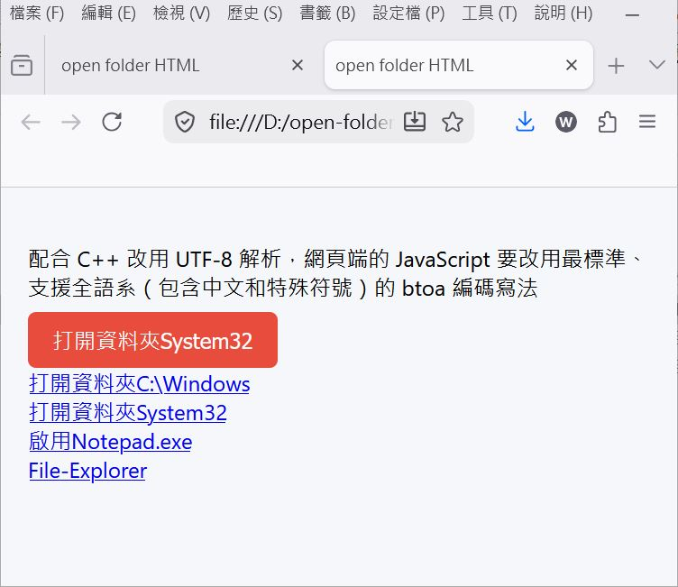

# Custom URI Scheme File Explorer Launcher


  


A lightweight, cross-platform workflow solution that allows web applications (`.html` pages running in a browser) to open local Windows File Explorer directories or native applications (like Notepad) via a custom URL protocol scheme. 

This project uses a compiled C++ Win32 wrapper (`open-folder.exe`) to securely handle, decode, and sanitize arguments passed from the browser before triggering system processes.

## 🚀 Features

* **Custom URL Protocols:** Register `mynotepad://`, `myexplorer://`, and `myexplorersubfolder://` custom URI schemes.
* **Web-to-Local Integration:** Launch local directory views directly from standard HTML links or button clicks.
* **Base64 & UTF-8 Robustness:** Handles complex file paths, spaces, Asian language characters (such as Traditional Chinese), and special symbols safely using standard Base64 encoding.
* **One-Click Registry Setup:** Easily install or completely tear down the protocol definitions using `.reg` files.

---

## 🛠️ Project Structure

* `open-folder.html`: The web frontend interface. Features an interactive UI with dynamic path injection and standard Javascript `btoa()` encoding to transport full paths safely.
* `open-folder.exe`: The pre-compiled C++ Win32 background handler (built via MinGW). It intercepts the browser URL argument, strips the protocol prefix, decodes the path string, and calls the native Windows API.
* `open-folder-html-protocol.reg`: Registry script to register the custom URI schemes into `HKEY_CLASSES_ROOT`.
* `open-folder-html-remove-protocol.reg`: Cleanup script to completely remove the custom URI protocols from your system registry.
* `demo.JPG`: Visual preview/screenshot of the application workflow in action.

---

## ⚙️ Architecture & Data Flow

Standard browser security restrictions prevent websites from directly calling local system binaries. This project bypasses that safely using the following flow:

[ HTML Page / Click Link ]  
│  (Paths are Base64 encoded to preserve UTF-8/spaces)  
▼  
[ Browser URI Scheme Invocation ] -> myexplorersubfolder://<base64_string>  
│  
▼  
[ Windows Registry Router ] -> Routes arguments to C:\Windows\open-folder.exe  
│  
▼  
[ open-folder.exe ]  
│  1. Strips URI scheme header  
│  2. Decodes Base64 string to a clean UTF-8 Windows string  
│  3. Sanitizes arguments  
▼  
[ Windows API (explorer.exe / ShellExecute) ] -> Opens the physical target folder  


## 💻 Installation & Setup

### 1. Place the Executable
Move the compiled binary handler `open-folder.exe` into your Windows system directory so that the registry commands can call it globally:
```cmd
copy open-folder.exe C:\Windows\
```

### 2. Register the URL Protocols

Double-click open-folder-html-protocol.reg and accept the Windows UAC prompt. This creates the following protocol paths inside your registry:  
```
    mynotepad:// -> Launches notepad.exe
    myexplorer:// -> Launches default explorer.exe
    myexplorersubfolder:// -> Routes through C:\Windows\open-folder.exe to handle explicit path variables securely.
```
	
###	3. Test the Setup  

Open open-folder.html in any standard web browser (Chrome, Edge, Firefox). Click on the configured test buttons (e.g., 打開資料夾System32 or 打開資料夾C:\Windows). Your browser will prompt you for permission to open the external handler—allow it, and the native folder will pop open immediately.  


## 🗑️ Uninstallation

If you wish to remove these configurations from your machine completely:  
```
	Run the open-folder-html-remove-protocol.reg file to wipe out the registry keys.  
    Delete C:\Windows\open-folder.exe.  
```	
	
## 🔒 Security Note  

When registering custom URI protocols that accept parameters, always ensure that arguments passed down by the browser are properly sanitized to prevent shell injection vulnerabilities. The native binary handler in this setup wraps targets inside structured Win32 API parameters rather than routing raw, unescaped strings directly to cmd.exe.	
	
